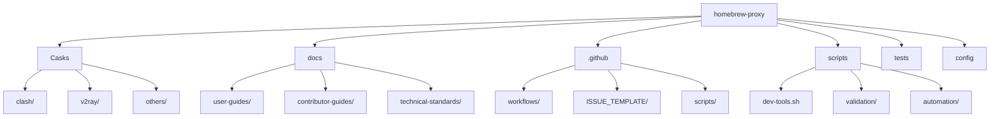
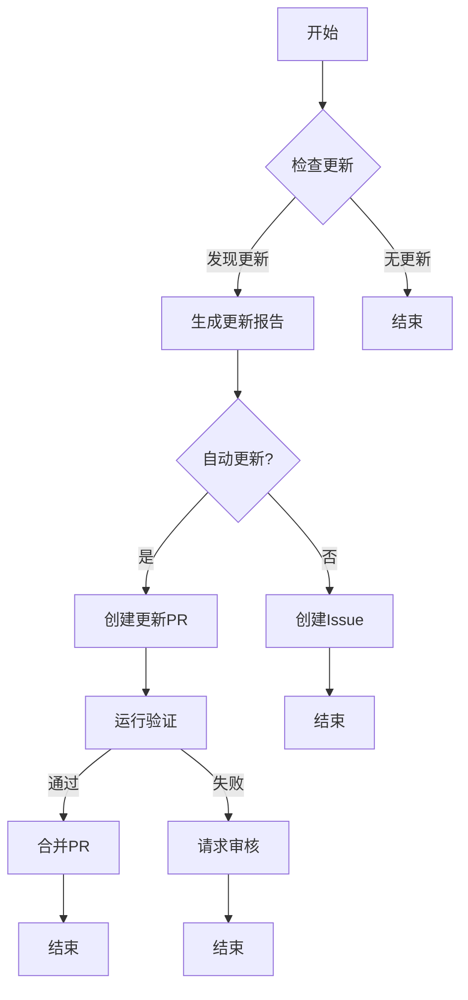
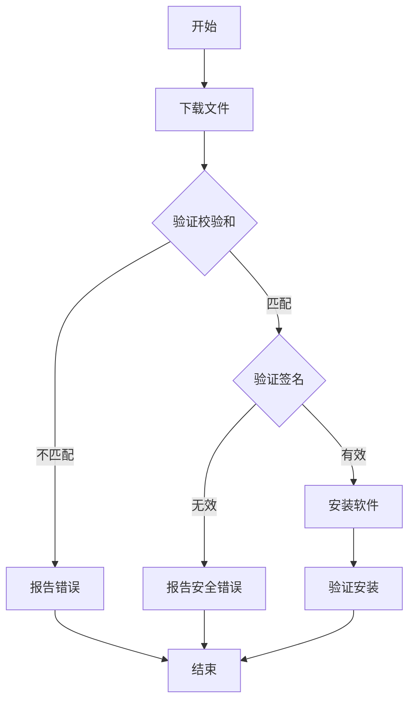

# 设计文档：项目优化

## 概述

本设计文档概述了基于指定需求优化 `homebrew-proxy` 项目的方法。优化将专注于改进目录结构、自动化、开发体验、用户体验、监控和安全性。该设计利用 Homebrew taps 的行业最佳实践，同时解决这个代理工具集合的特定需求。

## 架构

优化后的项目将遵循模块化架构，明确分离关注点：

```text
homebrew-proxy/
├── Casks/                  # Homebrew Cask 定义（分类）
├── Formula/                # Homebrew Formula 定义（如需要）
├── docs/                   # 集中式文档
├── .github/                # GitHub 特定文件（工作流、模板）
│   ├── workflows/          # CI/CD 流水线定义
│   ├── ISSUE_TEMPLATE/     # Issue 模板
│   └── scripts/            # GitHub Action 脚本
├── scripts/                # 开发和维护脚本
├── tests/                  # 验证测试套件
└── config/                 # 配置文件
```

### 关键架构决策

1. **分类 Casks**：按类型（clash、v2ray 等）将 Casks 组织到子目录中，以便更好地导航
2. **集中式文档**：将所有文档移至专用的 `docs/` 目录
3. **统一脚本管理**：创建具有通用入口点的中央脚本管理系统
4. **配置标准化**：使用一致的命名和放置方式标准化配置文件

## 组件和接口

### 1. 目录结构组件

**目的**：提供项目文件的逻辑组织

**关键元素**：

- 分类的 Cask 目录
- 集中式文档
- 标准化配置放置

**接口**：

- 文件系统组织
- 文档之间的交叉引用

### 2. 自动化系统

**目的**：自动化常规任务并确保一致性

**关键元素**：

- Cask 更新检测和报告
- 并行验证系统
- 带有安全扫描的 CI/CD 流水线

**接口**：

- GitHub Actions 工作流
- 命令行脚本
- 报告机制

### 3. 开发工具

**目的**：为贡献者提供工具和指南

**关键元素**：

- 环境设置脚本
- Cask 模板和验证器
- 用于代码风格强制执行的预提交钩子

**接口**：

- 命令行工具
- Git 钩子
- 文档

### 4. 用户体验增强

**目的**：改善终端用户的体验

**关键元素**：

- 组织更好的增强型 README
- 安装验证
- 故障排除指南

**接口**：

- 文档
- 安装脚本
- 错误处理

### 5. 监控和报告系统

**目的**：跟踪项目健康状况并提供洞察

**关键元素**：

- 健康报告生成
- 质量指标跟踪
- 贡献统计

**接口**：

- 报告脚本
- 用于自动报告的 GitHub Actions
- 文档中的可视化

### 6. 安全框架

**目的**：确保分发软件的安全性

**关键元素**：

- 签名和校验和验证
- 漏洞扫描
- 安全公告检查

**接口**：

- 验证脚本
- 安全扫描工具
- 报告机制

## 数据模型

### Cask 数据模型

```ruby
cask "example" do
  version "1.0.0"
  sha256 "abcdef123456..."

  url "https://example.com/download/example-#{version}.dmg"
  name "Example"
  desc "Example proxy tool"
  homepage "https://example.com/"

  livecheck do
    url :homepage
    strategy :page_match
    regex(/version (\d+\.\d+\.\d+)/i)
  end

  app "Example.app"

  zap trash: [
    "~/Library/Application Support/Example",
    "~/Library/Preferences/com.example.plist",
  ]
end
```

### 健康报告数据模型

```json
{
  "generated_at": "2024-07-17T12:00:00Z",
  "metrics": {
    "casks_count": 10,
    "last_update": "2 days ago",
    "contributors_count": 5,
    "commits_count": 120
  },
  "code_quality": {
    "average_file_size": "45 lines",
    "test_coverage": "85%",
    "technical_debt": "5 items"
  },
  "performance": {
    "average_validation_time": "2.3s",
    "success_rate": "98%",
    "error_rate": "2%"
  },
  "updates_available": [
    {
      "cask": "example-tool",
      "current_version": "1.0.0",
      "latest_version": "1.1.0"
    }
  ]
}
```

### 配置数据模型

```yaml
# 示例配置文件结构
format_standards:
  line_length: 120
  indentation: 2
  trailing_whitespace: false

validation:
  parallel_jobs: 4
  cache_ttl: 86400
  verify_signatures: true

automation:
  check_interval: "daily"
  auto_update: false
  notify_channels: ["issues", "pull_requests"]
```

## 错误处理

优化将实施全面的错误处理策略：

1. **优雅降级**：即使部分失败，系统也将继续运行
2. **详细错误报告**：清晰的错误消息和故障排除指导
3. **日志记录**：用于调试的全面日志
4. **恢复机制**：从常见故障场景自动恢复

### 错误类别

| 类别 | 描述 | 处理策略 |
|----------|-------------|-------------------|
| 验证错误 | Cask 验证问题 | 报告详情，建议修复 |
| 网络错误 | 更新期间的连接问题 | 使用退避策略重试，缓存之前的结果 |
| 格式错误 | 代码风格和格式问题 | 可能时自动修复，详细报告 |
| 安全错误 | 安全验证失败 | 阻止操作，详细安全报告 |
| 系统错误 | 操作系统或环境问题 | 优雅退出，环境诊断 |

## 测试策略

优化将实施多层测试方法：

### 1. 单元测试

- 测试单个脚本和函数
- 验证数据模型和转换
- 模拟外部依赖

### 2. 集成测试

- 测试组件之间的交互
- 验证工作流程
- 本地测试 GitHub Actions

### 3. 验证测试

- 根据 Homebrew 标准验证所有 Casks
- 检查常见错误和边缘情况
- 验证 livecheck 功能

### 4. 安全测试

- 验证签名验证
- 测试漏洞扫描
- 检查常见安全问题

### 5. 用户体验测试

- 验证文档清晰度
- 测试安装过程
- 验证错误消息和故障排除指南

## 实施考虑因素

### 1. 向后兼容性

- 保持与现有 Homebrew 工作流的兼容性
- 为贡献者提供迁移路径
- 清晰记录变更

### 2. 性能优化

- 实施并行处理进行验证
- 对网络操作使用缓存
- 优化 GitHub Actions 以加快 CI/CD

### 3. 可扩展性

- 为不断增长的 Casks 数量设计
- 实施模块化架构以便于扩展
- 为新组件创建模板

### 4. 可维护性

- 标准化代码风格和文档
- 实施全面注释
- 创建维护指南

## 图表

### 项目结构图



### 自动化工作流图



### 安全验证流程



## 结论

本设计为优化 `homebrew-proxy` 项目提供了全面的方法。通过实施这些变更，项目将受益于改进的组织、自动化、开发体验、用户体验、监控和安全性。模块化架构确保项目可以继续增长和发展，同时保持高质量和安全标准。
